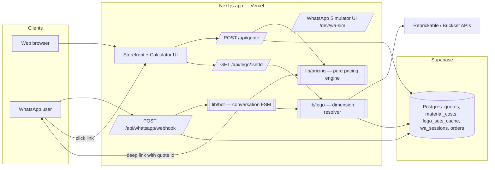

# BrickCase — Execution Plan
### Boutique e-commerce + smart WhatsApp bot for custom perspex (acrylic) LEGO display boxes

> **Status: PLANNING ONLY.** No feature code has been written. This document is the complete,
> incremental execution plan produced by the multi-agent planning pass. The execution phase
> starts only on explicit command, in a later session. Every phase below is written so a fresh
> session (any model) can execute it without additional context.

---

## 0. Foundational decision — stack & repo strategy

**Context found in repo:** a working Next.js 14 (App Router) + Supabase + Tailwind/shadcn
scaffold with auth flows, RLS-enabled Postgres schema, and an `orders`/`order_items` checkout
data model (built for a woodworking marketplace, phases 1–5 already committed).

**Decision (recommended and assumed by the rest of this plan):**

| Option | Verdict |
|---|---|
| **A. Reuse the existing Next.js + Supabase scaffold, rebrand & repurpose** | ✅ **Chosen.** Auth, DB, checkout skeleton, deploy path (Vercel) already exist. Next.js API routes give us real webhooks for the WhatsApp bot — something Streamlit cannot do cleanly. Parameterized checkout URLs (core requirement #4) are first-class in Next.js routing. |
| B. Fresh Streamlit prototype | ❌ Rejected for the main product: no real webhook endpoint, poor URL-param deep-linking, throwaway work for cart/checkout. |
| C. Streamlit as a side artifact | Optional stretch: a `tools/pricing_playground` Streamlit app for internally tuning pricing constants. Not on the critical path. |

**Repo actions in Phase 0 (execution time):** strip woodworking-specific pages/copy, keep
auth + supabase plumbing + shadcn components, rename branding to the display-box shop.

---

## 1. Agent 1 — System Architect

### 1.1 High-level architecture



**Single source of truth rule:** the pricing engine is one pure, side-effect-free TypeScript
module (`lib/pricing/engine.ts`). The web calculator, the `/api/quote` route, and the WhatsApp
bot all call the *same function*. Prices are never computed in the UI or in the bot layer.

### 1.2 WhatsApp → pricing → URL data flow (the critical path)

1. Inbound message hits `POST /api/whatsapp/webhook` (real provider or simulator — identical payload shape).
2. `lib/bot` loads/creates the `wa_sessions` row for that phone number and runs the FSM.
3. Parser extracts either dimensions (`30x20x25`, `L30 W20 H25`, cm/mm auto-detected) or a LEGO set ID (`10294`, `#10294-1`).
4. Set ID path: `lib/lego.resolveDimensions(setId)` → cache table first, external API on miss, writes back to `lego_sets_cache`.
5. `lib/pricing.calculatePrice(dims, baseType, config)` returns `{ price_cents, breakdown }`.
6. A row is inserted into `quotes` (dims, base, set id, price, breakdown JSON, channel=`whatsapp`, `expires_at = now()+72h`).
7. Bot replies with the price + a deep link: `https://<site>/checkout?quote=<quote_id>`.
8. Checkout page loads the quote **by ID from the DB** and renders the prefilled order.

**Security decision:** the deep link carries only an opaque `quote_id` (UUID) — never raw
price or dimensions. The server re-reads the persisted quote, so users cannot tamper with the
price via URL editing. A human-readable fallback (`/calculator?l=300&w=200&h=250&base=acrylic&set=10294`)
exists for shareable *calculator* links, but those always re-price server-side.

### 1.3 URL parameter contracts

| Route | Params | Behavior |
|---|---|---|
| `/checkout` | `quote` (UUID, required) | Loads persisted quote; 410 page if expired. |
| `/calculator` | `l`, `w`, `h` (mm, int), `base` (`none\|acrylic\|black_acrylic\|led`), `set` (LEGO set id), `src` (`wa\|web\|share`) | Prefills the calculator; price recomputed server-side. `set` triggers dimension auto-fill. |

### 1.4 Database schema (new migration `0002_display_boxes.sql`)

Reused as-is: `profiles`, `orders`, `order_items` (add `quote_id` FK to `order_items`).
Retired (dropped or ignored): woodworking-specific tables (`wood_types`, `artist_profiles`, inquiry tables) — dropped in the migration to keep the DB honest.

New tables (all RLS-enabled; money in integer cents; dimensions in integer mm):

```
material_costs      id, material ('acrylic_clear'|'acrylic_black'|...), thickness_mm,
                    cost_per_m2_cents, cut_cost_per_m_cents, effective_from, active
pricing_config      singleton-ish rows: waste_factor (e.g. 1.15), margin_pct (e.g. 0.18),
                    min_margin_cents, assembly_fee_cents, min_price_cents, rounding_step_cents
lego_sets_cache     set_id (pk, normalized '10294-1'), name, length_mm, width_mm, height_mm,
                    piece_count, source ('brickset'|'rebrickable'|'estimated'|'manual'),
                    confidence ('exact'|'estimated'), image_url, fetched_at
quotes              id uuid pk, length_mm, width_mm, height_mm, base_type, lego_set_id null,
                    price_cents, breakdown jsonb, channel ('web'|'whatsapp'), wa_phone null,
                    status ('active'|'converted'|'expired'), expires_at, created_at
wa_sessions         phone (pk), state, context jsonb, updated_at
wa_messages         id, phone, direction ('in'|'out'), body, created_at   -- audit/debug log
box_gallery         id, title, image_path, dims, blurb, sort_order        -- marketing gallery
```

RLS: `quotes` readable by anyone holding the UUID (select by id only, via API with service
role); `material_costs`/`pricing_config` admin-write, public-read; `wa_*` service-role only.

---

## 2. Agent 2 — Data & Backend Engineer

### 2.1 Pricing algorithm (`lib/pricing/engine.ts` — pure function + unit tests)

Inputs: `{ length_mm, width_mm, height_mm, base_type }` + config rows. Output: `{ price_cents, thickness_mm, breakdown }`.

1. **Validate & clamp**: 50mm ≤ each dim ≤ 1000mm (configurable); reject otherwise with a typed error the bot/UI can translate to a friendly message.
2. **Thickness selection** (structural rule of thumb, tunable in config):
   longest dim ≤ 300mm → 3mm; ≤ 600mm → 4mm; else 5mm.
3. **Panel area** (5-sided lid box): `2·(L·H) + 2·(W·H) + L·W`, converted to m².
4. **Material cost** = area × `cost_per_m2_cents[thickness]` × `waste_factor`.
5. **Base cost**: `none` = 0; `acrylic`/`black_acrylic` = base panel area × its material rate; `led` = base panel + flat LED component fee (config).
6. **Cut & assembly** = total cut length (panel perimeters, in m) × `cut_cost_per_m_cents` + `assembly_fee_cents`.
7. **Margin** = `max(subtotal × margin_pct, min_margin_cents)` — keeps the "fair price" promise while never selling below cost.
8. **Final** = round up to `rounding_step_cents` (e.g. nearest ₪5/€1), floor at `min_price_cents`.
9. `breakdown` JSON records every intermediate number → shown as "why this price" transparency in the UI and stored on the quote.

**Testing:** table-driven unit tests (vitest) with golden cases: tiny box, huge box, each base
type, clamp violations, rounding edges. The engine is dependency-free so tests run without DB.

### 2.2 LEGO dimension resolver (`lib/lego/resolver.ts`)

Reality check baked into the plan: **no single free API reliably returns *built-model*
dimensions for all sets.** Strategy = tiered resolution with explicit confidence:

1. **Cache**: `lego_sets_cache` hit (fresh < 90 days) → return immediately.
2. **Brickset API** (`getSets`): returns built dimensions (H×W×D) for many sets → `confidence: exact`.
3. **Rebrickable API**: fetch set name, piece count, image (no built dims) → feed step 4.
4. **Heuristic estimator**: regression from piece count + theme → estimated dims × 1.1 safety padding → `confidence: estimated`. Bot/UI must *say* "estimated — please verify".
5. **Manual override**: admin can upsert exact dims into the cache; user can always correct the auto-filled numbers before ordering.

Display clearance padding (+10mm per axis, config) is added *after* resolution, before pricing.

API keys via env: `BRICKSET_API_KEY`, `REBRICKABLE_API_KEY` (added to `.env.example`; graceful
degradation to heuristic-only when absent, so the demo runs with zero keys).

### 2.3 API surface

| Endpoint | Contract |
|---|---|
| `POST /api/quote` | body `{l,w,h,base,setId?,channel}` → creates quote row → `{quoteId, priceCents, breakdown, expiresAt}` |
| `GET /api/quote/:id` | persisted quote for the checkout page |
| `GET /api/lego/:setId` | resolver result `{name, dims, confidence, imageUrl}` |
| `POST /api/whatsapp/webhook` | provider-agnostic inbound message (Agent 4 owns the internals) |
| `POST /api/orders` | quote → order conversion at checkout (marks quote `converted`) |

Zod schemas for every request/response in `lib/validations/` (pattern already in repo).

---

## 3. Agent 3 — Frontend Developer

Stack: existing Next.js App Router + Tailwind + shadcn/ui (Streamlit rejected — §0).

### 3.1 Page map

```
app/
├── (marketing)/page.tsx          # Landing: hero, value props ("fair algorithmic pricing"),
│                                 #   gallery strip, CTA → calculator, WhatsApp CTA button
├── (marketing)/gallery/          # box_gallery grid, lightbox
├── (shop)/calculator/            # THE core page (below)
├── (shop)/cart/                  # single-quote cart (MVP: 1 line item), qty
├── (shop)/checkout/              # quote summary, customer details form, mock payment,
│                                 #   order confirmation; reads ?quote=<id>
└── (dev)/wa-sim/                 # WhatsApp simulator chat UI (Agent 4, dev-only route)
```

### 3.2 Calculator UX (the conversion engine)

- Two entry tabs: **"I know my dimensions"** (L/W/H inputs, mm/cm toggle, base-type radio cards with thumbnails) and **"I have a LEGO set"** (set-ID input → calls `/api/lego/:id` → shows set name + image + auto-filled dims, editable, with an "estimated" badge when confidence ≠ exact).
- **Live price**: debounced call to `POST /api/quote` on change; big price display + collapsible "How is this calculated?" breakdown (from `breakdown` JSON) — the transparency feature that sells "fair pricing".
- 3D-ish CSS/SVG box preview that scales with dims (stretch: not blocking).
- CTA "Order this box" → creates/refreshes quote → `/checkout?quote=<id>`.
- URL-param hydration per §1.3 so bot links and shared links land prefilled.

### 3.3 Component inventory (new, under `components/shop/`)

`DimensionForm`, `BaseTypePicker`, `SetIdLookup`, `PriceCard`, `PriceBreakdown`,
`BoxPreview`, `QuoteSummary`, `CheckoutForm`, `GalleryGrid`, `WhatsAppCta`.
All shadcn primitives already installed cover the needs — no new UI deps.

### 3.4 Non-functional

Mobile-first (WhatsApp traffic *is* mobile), skeleton loaders on API calls, empty/expired-quote
states, SEO metadata on marketing pages, all copy centralized for later i18n.

---

## 4. Agent 4 — Integration Specialist (WhatsApp bot)

### 4.1 Provider-agnostic design

`lib/bot/` never imports a vendor SDK. Adapter interface:

```ts
interface WaAdapter { sendMessage(phone: string, body: string): Promise<void> }
```

- **`SimulatorAdapter`** (MVP/demo): messages round-trip through the `/dev/wa-sim` chat UI, which POSTs to the same `/api/whatsapp/webhook` and polls/streams outbound replies from `wa_messages`. Zero external accounts needed for the demo.
- **`MetaCloudAdapter` / `TwilioAdapter`** (post-MVP stubs): same interface; webhook route already normalizes both payload shapes into one internal `InboundMessage` type, so going live is config + credentials, not a rewrite.

### 4.2 Conversation FSM (state persisted in `wa_sessions.state` + `context`)

```
IDLE ──any msg──▶ GREETING  "Hi! Send box dimensions (e.g. 30x20x25 cm)
                             or a LEGO set number (e.g. 10294)."
GREETING ─dims parsed──────▶ ASK_BASE   "Base? 1) None 2) Clear acrylic 3) Black 4) LED"
GREETING ─set id parsed────▶ CONFIRM_SET "Found: Titanic #10294, ~135×16×44cm (est.).
                                          Use these dimensions? (yes/edit)"
CONFIRM_SET ─yes───────────▶ ASK_BASE
CONFIRM_SET ─edit──────────▶ GREETING (asks for manual dims)
ASK_BASE ─choice───────────▶ QUOTED     "💰 Estimated price: ₪249. Complete your order:
                                          https://site/checkout?quote=ab12…  (valid 72h)"
QUOTED ─new input──────────▶ restart from parse   any state ─"help"/garbage×2─▶ HUMAN_HANDOFF
```

Parsing rules (unit-tested): dimension regex accepts `30x20x25`, `30*20*25`, `L30 W20 H25`,
`,`/`.` decimals; values ≤ 120 interpreted as cm, else mm; set IDs = 3–7 digits with optional
`-1` suffix and optional `#`.

### 4.3 Bot → pricing → link (glue, all inside the webhook handler)

`parse → resolve (Agent 2 lego lib) → price (Agent 2 engine) → insert quote → adapter.sendMessage(price + link)`.
Every in/out message logged to `wa_messages`. Idempotency: provider message-id dedup guard.

---

## 5. Incremental execution phases (the actual to-do list)

Each phase ends **green and demoable**; commit per phase on this branch.

| Phase | Owner(s) | Deliverables | Acceptance criteria |
|---|---|---|---|
| **P0 — Repurpose scaffold** | Architect | Strip woodworking pages/copy; rebrand (name, README, layout); keep auth/supabase/shadcn plumbing; update `.env.example` (+ LEGO API keys, `NEXT_PUBLIC_SITE_URL`) | `npm run build` passes; landing renders new brand |
| **P1 — Schema** | Architect | Migration `0002_display_boxes.sql` (new tables §1.4, drops, RLS, seed: material costs, pricing config, 6 gallery items, 5 cached famous sets); regenerated `types/database.types.ts`; ARCHITECTURE.md rewrite | Migration applies cleanly on fresh DB; seeds visible |
| **P2 — Pricing engine + quote API** | Backend | `lib/pricing` + vitest golden tests; `POST /api/quote`, `GET /api/quote/:id` | All tests pass; curl returns sane prices for 3 reference boxes |
| **P3 — LEGO resolver** | Backend | `lib/lego` tiered resolver + cache + heuristic fallback; `GET /api/lego/:setId`; works keyless (heuristic) | `10294` returns dims + confidence; second call hits cache |
| **P4 — Calculator & storefront UI** | Frontend | Landing, gallery, calculator (both tabs, live price, breakdown), URL-param hydration | Manual flow: enter dims → price matches engine test values; set-ID tab autofills |
| **P5 — Cart & checkout** | Frontend | `/cart`, `/checkout?quote=`, order creation (mock payment), confirmation, quote expiry page | Quote UUID → prefilled checkout → order row created, quote `converted` |
| **P6 — WhatsApp bot + simulator** | Integration | Webhook route, FSM, parsers + tests, `SimulatorAdapter`, `/dev/wa-sim` chat UI | In simulator: send `10294` → confirm → base → receive price + working checkout link |
| **P7 — E2E hardening & demo script** | All | End-to-end walkthrough (web path + bot path), edge cases (expired quote, bad set id, garbage input), README "Demo in 5 minutes" section, deploy notes | Both golden paths pass scripted E2E checklist |

**Dependency graph:** P0→P1→P2→{P3, P4}→P5→P6→P7 (P3 and P4 can run in parallel).

### Risks & mitigations
- *Built-set dimensions unavailable* → tiered resolver + visible confidence + user-editable dims (§2.2). Never blocks a quote.
- *WhatsApp Business API approval friction* → simulator-first adapter design (§4.1); demo needs no external account.
- *Price tampering via URL* → opaque quote IDs, server-side re-pricing (§1.2).
- *Material price drift* → `material_costs.effective_from` versioning; quotes freeze their breakdown; 72h expiry.

---

*End of plan. Awaiting explicit execution command before any implementation begins.*
